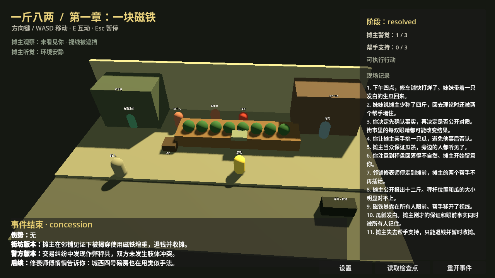

# Huaqiang Game Lab

[English](README.md) · [简体中文](README.zh-CN.md)


> A small, evidence-led game design lab exploring **social stealth**, readable consequences, and high-pressure encounters in an original Chinese industrial-city setting.

[](一斤八两/README.md)
[](一斤八两/vertical_slice/README.md)
[](一斤八两/README.md)
[](LICENSE)

## In 30 seconds

This repository is a home for Huaqiang game experiments. Its main artifact is **《一斤八两》**, a third-person social-stealth / action-thriller prototype set in the fictional late-1990s industrial city of 铁衡市.

The design question: can a tense encounter be won through **observation, social pressure, spatial preparation, and an escape plan** rather than a conventional combat loop? It is tested at three levels—rules prototype, browser greybox, and Godot vertical slice—alongside decision, risk, and originality records.

This is an **experimental Phase 4 engineering candidate**, not a finished game, commercial release, or claim of external playtest validation.

## What is here

| Area | Purpose | Start here |
| --- | --- | --- |
| `一斤八两/` | Main concept, design records, prototypes, and vertical slice | [Game README](一斤八两/README.md) |
| `一斤八两/prototype/` | Python rules model for facts, witnesses, space, conflict, and narrative | [Prototype guide](一斤八两/prototype/README.md) |
| `一斤八两/greybox/` | Dependency-light browser interaction greybox | `npm test` then `npm start` |
| `一斤八两/vertical_slice/` | Godot 4.7.1 3D playable slice with tests and captures | [Godot guide](一斤八两/vertical_slice/README.md) |
| `ideas/` | Adjacent short-form concepts | [Ideas index](ideas/README.md) |
| `game_dev_flow.md` | Development-process reference | [Workflow](game_dev_flow.md) |

## Why this approach 🎮

- **Preparation changes the outcome:** object positions, witnesses, routes, and public commitments affect what happens next.
- **Two stories survive an event:** the system distinguishes what happened from what witnesses and authorities believe happened.
- **Three playable routes:** the current slice supports public pressure, prepared withdrawal, and an unprepared escape with injury.
- **Three validation layers:** Python rules, a browser greybox, and a rendered Godot slice expose assumptions before expensive production.
- **Low-cost iteration:** the world is intentionally procedural and greybox-quality, testing interaction and consequence before final art.

## Quick start

Requires Node.js and Python 3 for the first two paths:

```bash
cd 一斤八两/greybox
npm test
npm start
# Open http://localhost:4173
```

```bash
cd 一斤八两/prototype
python -m unittest discover -s tests -v
python play.py
```

For the 3D slice, install **Godot 4.7.1 stable**, set `GODOT_BIN` if needed, then run:

```bash
export GODOT_BIN=/path/to/Godot_v4.7.1-stable_linux.x86_64
cd 一斤八两/vertical_slice
bash tools/run_godot.sh
bash tools/test_godot.sh
```

`WASD` / arrows move, the mouse rotates the camera, `E` performs the nearest valid interaction, and `Esc` pauses/releases the mouse. Capture and Linux export scripts are documented in the Godot README.

## See it

Existing rendered evidence from the vertical slice:

| Arrival / interaction space | Resolved event |
| --- | --- |
|  |  |

More captures: [`vertical_slice/screenshots/`](一斤八两/vertical_slice/screenshots/).

## Goals and non-goals

### Goals

- Prove a compact, replayable social-stealth encounter with legible consequences.
- Make preparation visible through NPC behaviour and event logs.
- Build toward a **6–8 hour** single-player PC game only if the slice earns it.

### Non-goals

- No open-world crime sandbox, multiplayer, live service, or procedural main story.
- No generic combo-driven action loop or “find every highlighted clue” formula.
- No protected television characters, dialogue, recordings, music, likenesses, or shots; see [`一斤八两/docs/originality-and-ip.md`](一斤八两/docs/originality-and-ip.md).

## Roadmap 🧭

1. **Now — owner acceptance:** complete all three routes and record duration, clarity, and replay desire.
2. **Next — slice refinement:** address only acceptance findings; decide whether the low-poly and procedural-audio direction earns more investment.
3. **Later — production decision:** if the slice passes, scope a small complete game; otherwise shrink, redirect, or stop.

The intended end state is an offline, single-player PC game with dense semi-open neighbourhoods, but that is a target—not a promise or release commitment.

## Caveats

This is unfinished. Art, animation, voice, audio, and camera are not final quality. Godot is validated on Linux with 4.7.1; other platforms are unverified. Automated tests validate rules and technical paths, not fun, market demand, accessibility completeness, or owner acceptance. Do not infer financing, authorization, external playtesting, a release date, or production approval.

## Contributing

Start with [`一斤八两/CONTRIBUTING.md`](一斤八两/CONTRIBUTING.md). Keep changes small and evidence-backed, preserve stage gates, and do not add unlicensed media or material derived from protected source works. Documentation, reproducible tests, and clearly described design experiments are welcome.

## License

Unless a nested artifact states otherwise, this collection is licensed under [GNU Affero General Public License v3.0 only](LICENSE).
