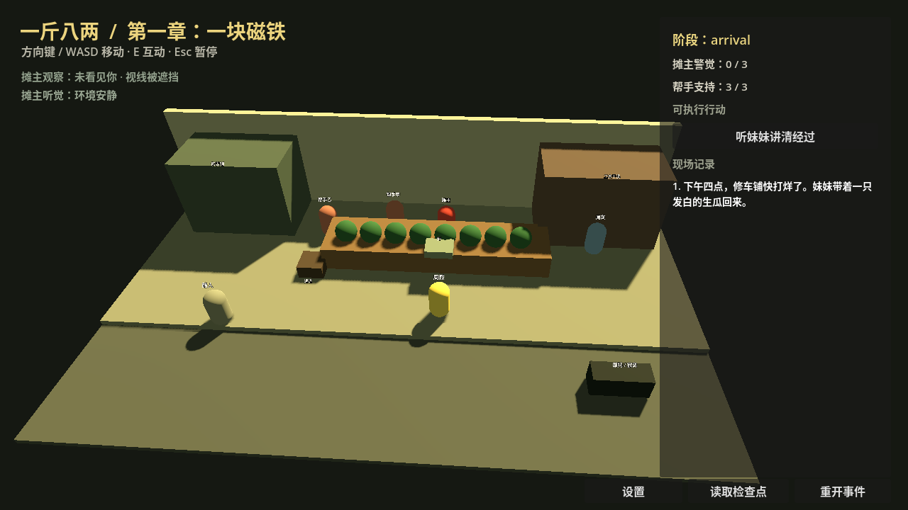

# 一斤八两

[English](../README.md) · [简体中文](README.md)



> **先赢局，再动手。** 一款原创北方工业城背景的第三人称社会潜行 / 动作惊悚游戏实验：观察事实、操纵空间、试探人物，在短促危险的冲突前取得优势，并承担事件被他人重新讲述的后果。

[](docs/phase-4-progress.md)
[](vertical_slice/README.md)
[](../LICENSE)

《一斤八两》是一款以 1990 年代末虚构北方工业城为背景的第三人称社会潜行 / 动作惊悚游戏。

玩家通过观察事实、试探人物、改变空间条件和安排退路控制冲突。战斗短促且危险；理想结果通常是在冲突发生前取得决定性优势，并承担事实如何被证人和社会重新讲述的后果。

## 当前状态

项目已完成 Phase 0，并以 **Conditional Go** 通过 Phase 1–3。当前处于 **Phase 4**，已建立 Godot 4.7.1 垂直切片基础版，但尚未达到完整垂直切片门槛。

不得在 Phase 0 阶段对外宣称游戏已进入制作、获得授权、完成融资或确定发行日期。

## 为什么值得关注 🎮

- **事实、证人、流言分离：**打赢现场不一定赢得街坊、警方或未来。
- **三条完整路径：**公开施压、准备后撤离、无准备负伤逃离都可从开场走到结局。
- **三层验证：**Python 规则原型、浏览器灰盒、Godot 3D 切片逐层验证核心假设。
- **可解释的系统反馈：**NPC 会根据距离、视角、遮挡和声音暴露反应，事件日志记录因果。

## 快速开始

无需安装依赖即可先阅读设计文档；试玩各层实验：

```bash
# 浏览器灰盒（Node.js + Python 3）
cd greybox && npm test && npm start

# 规则原型（Python 3）
cd ../prototype && python -m unittest discover -s tests -v && python play.py
```

3D 切片需要 **Godot 4.7.1 stable**，运行、测试、截图和 Linux 导出命令见 [`vertical_slice/README.md`](vertical_slice/README.md)。

## 目标与非目标

目标是先证明一个紧凑、可重玩、失败原因可解释的社会潜行事件；若切片通过，才考虑 **6–8 小时**的单机 PC 游戏。

非目标包括开放世界犯罪沙盒、多人 / 在线服务、常规连招动作循环，以及对任何影视 IP 的人物、台词、镜头、录音或肖像复刻。原创化边界见 [`docs/originality-and-ip.md`](docs/originality-and-ip.md)。

## 路线图 🧭

1. **所有者验收：**完成三路线试玩，记录时长、可解释性和重玩意愿。
2. **切片修整：**只处理验收暴露的问题，评估低多边形视觉和程序化音频方向。
3. **制作决策：**通过后再锁定小规模完整游戏范围；否则缩小、转向或停止。

## 限制与注意事项

角色、美术、动画、配音、音频和镜头仍是原型质量；Godot 构建只在 Linux + 4.7.1 验证。自动测试不能证明好玩、市场需求、无障碍完整度或所有者验收。详细阶段记录、风险和决策见 [`docs/`](docs/)；协作规则见 [`CONTRIBUTING.md`](CONTRIBUTING.md)。

## 文档入口

- [完整开发计划](dev_plan.md)
- [项目章程](docs/project-charter.md)
- [原创化与知识产权边界](docs/originality-and-ip.md)
- [风险登记表](docs/risk-register.md)
- [项目决策登记表](docs/decision-register.md)
- [Phase 1 概念与可行性基线](docs/phase-1-concept.md)
- [Phase 1 所有者概念测试](docs/phase-1-owner-test.md)
- [Phase 2 阶段门](docs/phase-2-gate.md)
- [Phase 2 规则原型](prototype/README.md)
- [Phase 3 引擎决定](docs/phase-3-engine-decision.md)
- [Phase 3 阶段门](docs/phase-3-gate.md)
- [Phase 4 进度](docs/phase-4-progress.md)
- [Godot 垂直切片基础版](vertical_slice/README.md)

## 运行交互灰盒

```bash
cd huaqiang_game/一斤八两/greybox
npm test
npm start
```
- [贡献与版本规范](CONTRIBUTING.md)

## 本地检查

```bash
bash tools/validate_phase0.sh
bash tools/validate_phase1.sh
```

该命令只检查 Phase 0 文档和目录是否完整，不代表法律、融资、人员或市场验证已经通过。
